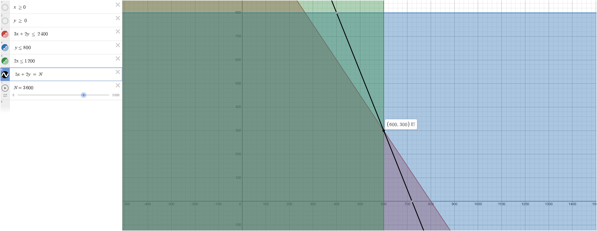
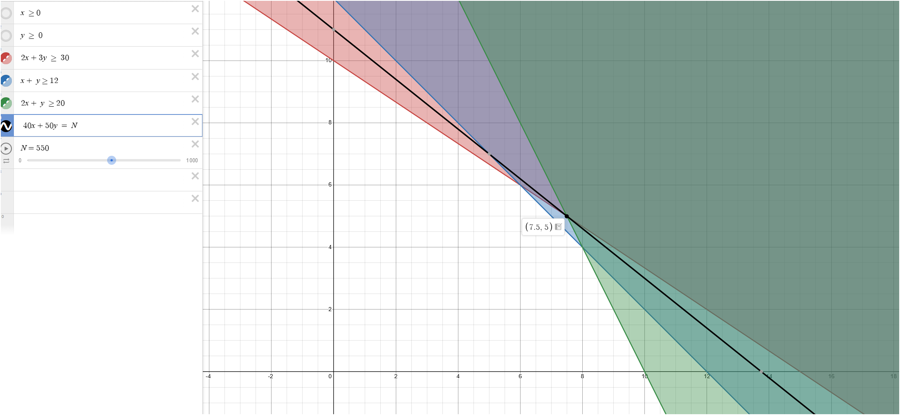
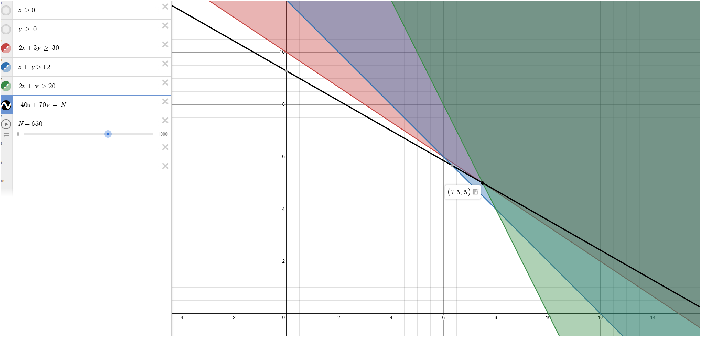
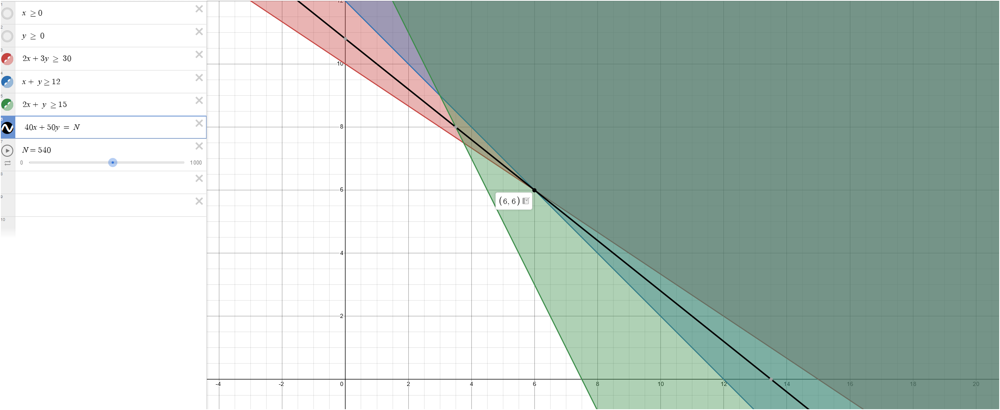

## 1. The Primo Insurance Company is introducing two new product lines: special risk
insurance and mortgages. The expected profit is $5 per unit on special risk insurance and
$2 per unit on mortgages. Management wishes to establish sales quotas for the new
product lines to maximize total expected profit. The work requirements are as follows:
```{r, echo=FALSE}
library(gt)
df <- data.frame(
  Department = c("Underwriting", "Administration", "Claims"),
  Special.Risk = c(3, 0, 2),
  Mortgage = c(2, 1, 0),
  Work.Hours.Available = c(2400, 800, 1200)
)

# Rename for better display
colnames(df) <- c("Department", "Special Risk", "Mortgage", "Work-Hours Available")

df %>%
  gt() %>%
  tab_header(title = "Work Requirements Table") %>%
  
  # Center align all columns
  cols_align(
    align = "center",
    columns = everything()
  ) %>%
  
  # Add bold formatting to the header row
  tab_style(
    style = list(
      cell_text(weight = "bold", size = px(15))
    ),
    locations = cells_column_labels(columns = everything())
  ) %>%
  
  # Add column borders
  tab_style(
    style = cell_borders(sides = c("left", "right"), color = "black", weight = px(1)),
    locations = cells_body(columns = everything())
  ) %>%
  
  # Add row lines (horizontal lines between rows)
  tab_style(
    style = cell_borders(sides = "bottom", color = "gray", weight = px(1)),
    locations = cells_body(rows = everything())
  ) %>%
  
  # Add a border at the bottom of the header row
  tab_style(
    style = cell_borders(sides = "bottom", color = "black", weight = px(2)),
    locations = cells_column_labels(columns = everything())
  )
```

### A. Linear Programming Model:

#### Maximize \( Z = 5x + 2y \)

#### Subject to:

\[
3x + 2y \leq 2400 \quad \text{(Underwriting constraint)}
\]

\[
y \leq 800 \quad \text{(Administration constraint)}
\]

\[
2x \leq 1200 \quad \text{(Claims constraint)}
\]

#### Non-negativity constraints:

\[
x \geq 0, \quad y \geq 0
\]

### B. The Graphical Method
```{r, echo=FALSE, out.width='100%'}



```

### The answer in Graphical Method is (600,300)

### C. Verify Algebraically the solution of Part B

#### Step 1: Check the constraints at  (x = 600, y = 300) .

1. **Underwriting constraint**:
\[
3x + 2y = 3(600) + 2(300) = 1800 + 600 = 2400
\]
This satisfies \( 3x + 2y \leq 2400 \).

2. **Administration constraint**:
\[
y = 300 \leq 800
\]
This satisfies \( y \leq 800 \).

3. **Claims constraint**:
\[
2x = 2(600) = 1200
\]
This satisfies \( 2x \leq 1200 \).

#### Step 2: Solve algebraically for \( x \) and \( y \).

From the constraints, we solve the system of equations:
1. \( 3x + 2y = 2400 \) (Underwriting constraint)
2. \( 2x = 1200 \) (Claims constraint)

From the second equation:
\[
x = \frac{1200}{2} = 600
\]

Substitute \( x = 600 \) into the first equation:
\[
3(600) + 2y = 2400
\]
\[
1800 + 2y = 2400
\]
\[
2y = 2400 - 1800 = 600
\]
\[
y = \frac{600}{2} = 300
\]

Thus, the optimal solution is \( x = 600 \) and \( y = 300 \), which matches the graphical solution.

#### Conclusion:
The algebraic solution confirms that the optimal values for \( x \) (Special Risk) and \( y \) (Mortgage) are \( 600 \) and \( 300 \), respectively. The maximum value of \( Z \) is:
\[
Z = 5(600) + 2(300) = 3000 + 600 = 3600
\]

Therefore, the optimal solution is \( (600, 300) \) with a maximum value of \( Z = 3600 \).

## 2. Consider the model

#### Minimize \( Z = 40x_1 + 50x_2 \)

#### Subject to:

\[
2x_1 + 3x_2 \geq 30  
\]

\[
x_1 + x_2 \geq 12 
\]

\[
2x_1 + x_2 \geq 20 
\]

#### Non-negativity constraints:

\[
x_1 \geq 0, \quad x_2 \geq 0
\]

### A. The Graphical Method

```{r, echo=FALSE, out.width='100%'}



```

### The answer in Graphical Method is (7.5,5)

#### Verify Feasibility of \((7.5,5)\)

Satisfies all the constraints:

1. **For \(2x_1 + 3x_2 \geq 30\):**
   \[
   2(7.5) + 3(5) = 15 + 15 = 30 \quad \checkmark
   \]
2. **For \(x_1 + x_2 \geq 12\):**
   \[
   7.5 + 5 = 12.5 \geq 12 \quad \checkmark
   \]
3. **For \(2x_1 + x_2 \geq 20\):**
   \[
   2(7.5) + 5 = 15 + 5 = 20 \quad \checkmark
   \]
4. **Non-negativity:**
   \[
   7.5 \geq 0,\quad 5 \geq 0 \quad \checkmark
   \]

Since all constraints are satisfied, \((7.5,5)\) is feasible.

### Compute the Objective Function Value

Evaluate \(Z\) at \((7.5,5)\):
\[
Z = 40(7.5) + 50(5) = 300 + 250 = 550.
\]

### Conclusion

The optimal solution for the problem is:
\[
(x_1, x_2) = (7.5,5)
\]
with a minimum value of:
\[
Z = 550.
\]

### B. How does the optimal solution change if the objective function is changed to:

\[
Z = 40x_1 + 70x_2
\]

### C. If the third functional constraint is changed to:

\[
2x_1 + x_2 \geq 15
\]

### Graphical Method Answer B

```{r, echo=FALSE, out.width='100%'}

```

#### Changing the objective function affects the minimum profit or the optimal solution. For example, in Question B, with the objective function \( Z = 40x_1 + 70x_2 \), the minimum profit is \( Z = 650 \), compared to \( Z = 550 \) with the original equation. These changes cause the graph to tilt more to the left or right, depending on how \( x_1 \) and \( x_2 \) change.

### Graphical Method Answer C

```{r, echo=FALSE, out.width='100%'}

```

#### Changing the constraint function also affects the minimum profit, but it has a bigger impact by changing the feasible area and the positions of the points where the lines meet on the graph. For instance, in Question C, when the constraint is changed to \( 2x_1 + x_2 \geq 15 \), the minimum profit becomes \( Z = 540 \), compared to the original \( Z = 550 \). This change affects the shape and size of the feasible area, which then changes the optimal solution.
