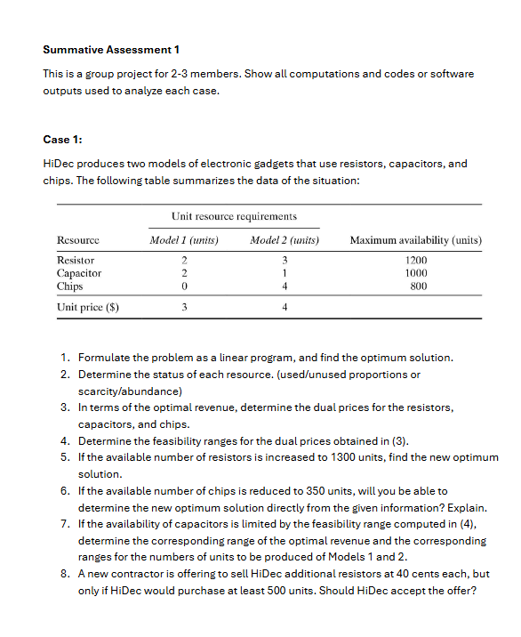
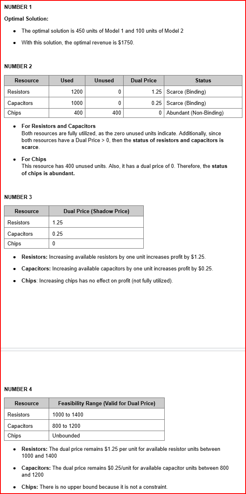
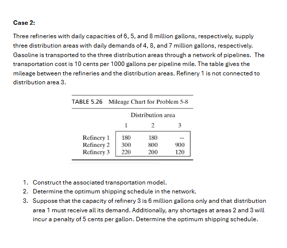
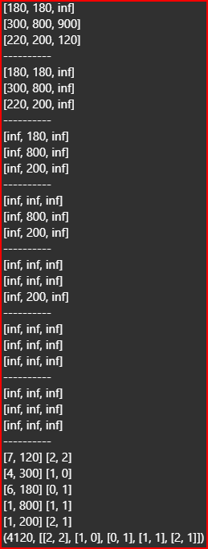

## Case 1

\[
\text{Maximize: } Z = 3x_1 + 4x_2
\]

\[
\text{Subject to:}
\]
\[
\begin{aligned}
    2x_1 + 3x_2 &\leq 1200 \space \text{Resistors} \\
    2x_1 + 1x_2 &\leq 1000 \space \text{Capacitor} \\
    4x_2 &\leq 1000 \space \text{Chips} \\
    x_1, x_2 &\geq 0 \space \text{Non-Negative}
\end{aligned}
\]

```{r echo=TRUE, eval=FALSE}
if (!require(lpSolve)) install.packages("lpSolve")
library(lpSolve)

# coefficients of the objective function
objective <- c(3, 4)  # Model 1 = $3, Model 2 = $4

# constraints matrix (resource usage per unit)
constraints <- matrix(c(2, 3,  # Resistor usage
                        2, 1,  # Capacitor usage
                        0, 4), # Chips usage
                      nrow = 3, byrow = TRUE)

# right-hand side of the constraints
rhs <- c(1200, 1000, 800)

# direction of the constraints (<=)
directions <- c("<=", "<=", "<=")

# Solve the lp
solution <- lp(direction = "max",
               objective.in = objective,
               const.mat = constraints,
               const.dir = directions,
               const.rhs = rhs,
               compute.sens = TRUE)
# Output the results
cat("Optimal Solution:\n")
cat(solution$solution, "Model 1 and Model 2")

shadow_prices <- solution$duals[1:length(rhs)]  # Extract duals for constraints
names(shadow_prices) <- c("Resistors", "Capacitors", "Chips")
print(shadow_prices)

cat("\nMaximum Profit: $", solution$objval, "\n")

# Analyze resource usage
cat("\nResource Usage Status:\n")
used_resources <- constraints %*% solution$solution # Matrix Multiply and Find used resources
for (i in 1:length(rhs)) {
  unused <- rhs[i] - used_resources[i]
  if (abs(unused) < 1e-12) unused <- 0 # remove Floating point Error small numbers
  cat(paste0("Resource ", i, ": Used = ", used_resources[i], ", Unused = ", unused, "\n"))
  lower_bound <- solution$duals.from[i]
  upper_bound <- solution$duals.to[i]
  
  if (solution$duals[i] == 0) {
    cat(paste0("Feasability Range ", i, ": Unbounded above (Shadow Price = 0)\n"))
  } else {
    cat(paste0("Feasability Range ", i, ": Lower Bound = ", lower_bound,
               ", Upper Bound = ", upper_bound, "\n"))
  }
}
```
```{r echo=FALSE, eval=TRUE}
# Output the results
if (!require(lpSolve)) install.packages("lpSolve")
library(lpSolve)

# coefficients of the objective function
objective <- c(3, 4)  # Model 1 = $3, Model 2 = $4

# constraints matrix (resource usage per unit)
constraints <- matrix(c(2, 3,  # Resistor usage
                        2, 1,  # Capacitor usage
                        0, 4), # Chips usage
                      nrow = 3, byrow = TRUE)

# right-hand side of the constraints
rhs <- c(1200, 1000, 800)

# direction of the constraints (<=)
directions <- c("<=", "<=", "<=")

# Solve the lp
solution <- lp(direction = "max",
               objective.in = objective,
               const.mat = constraints,
               const.dir = directions,
               const.rhs = rhs,
               compute.sens = TRUE)
# Output the results
cat("Optimal Solution:\n")
cat(solution$solution, "Model 1 and Model 2")

shadow_prices <- solution$duals[1:length(rhs)]  # Extract duals for constraints
names(shadow_prices) <- c("Resistors", "Capacitors", "Chips")
print(shadow_prices)

cat("\nMaximum Profit: $", solution$objval, "\n")

# Analyze resource usage
cat("\nResource Usage Status:\n")
used_resources <- constraints %*% solution$solution
for (i in 1:length(rhs)) {
  unused <- rhs[i] - used_resources[i]
  if (abs(unused) < 1e-10) unused <- 0
  cat(paste0("Resource ", i, ": Used = ", used_resources[i], ", Unused = ", unused, "\n"))
  lower_bound <- solution$duals.from[i]
  upper_bound <- solution$duals.to[i]
  
  if (solution$duals[i] == 0) {
    cat(paste0("Feasability Range ", i, ": Unbounded above (Shadow Price = 0)\n"))
  } else {
    cat(paste0("Feasability Range ", i, ": Lower Bound = ", lower_bound,
               ", Upper Bound = ", upper_bound, "\n"))
  }
}
```


#### Question 5
Increasing the Resistor availability to 1300, based on the dual prices and feasibility analysis from Q3 and Q4, results in a profit increase with minimal impact on the overall resource capacity. The change primarily leads to higher usage of Chips while shifting production priorities—producing more of Model 2 and slightly less of Model 1 to optimize profits. This adjustment effectively leverages the additional Resistors for greater profitability.
```{r echo=FALSE}
if (!require(lpSolve)) install.packages("lpSolve")
library(lpSolve)

# coefficients of the objective function
objective <- c(3, 4)  # Model 1 = $3, Model 2 = $4

# constraints matrix (resource usage per unit)
constraints <- matrix(c(2, 3,  # Resistor usage
                        2, 1,  # Capacitor usage
                        0, 4), # Chips usage
                      nrow = 3, byrow = TRUE)

# right-hand side of the constraints
rhs <- c(1300, 1000, 800)

# direction of the constraints (<=)
directions <- c("<=", "<=", "<=")

# Solve the lp
solution <- lp(direction = "max",
               objective.in = objective,
               const.mat = constraints,
               const.dir = directions,
               const.rhs = rhs,
               compute.sens = TRUE)
# Output the results
cat("Optimal Solution:\n")
cat(solution$solution, "Model 1 and Model 2")

shadow_prices <- solution$duals[1:length(rhs)]  # Extract duals for constraints
names(shadow_prices) <- c("Resistors", "Capacitors", "Chips")
print(shadow_prices)

cat("\nMaximum Profit: $", solution$objval, "\n")

# Analyze resource usage
cat("\nResource Usage Status:\n")
used_resources <- constraints %*% solution$solution
for (i in 1:length(rhs)) {
  unused <- rhs[i] - used_resources[i]
  if (abs(unused) < 1e-10) unused <- 0
  cat(paste0("Resource ", i, ": Used = ", used_resources[i], ", Unused = ", unused, "\n"))
  lower_bound <- solution$duals.from[i]
  upper_bound <- solution$duals.to[i]
  
  if (solution$duals[i] == 0) {
    cat(paste0("Feasability Range ", i, ": Unbounded above (Shadow Price = 0)\n"))
  } else {
    cat(paste0("Feasability Range ", i, ": Lower Bound = ", lower_bound,
               ", Upper Bound = ", upper_bound, "\n"))
  }
}
```
#### Question 6
Reducing the Chips capacity to 350, we can intuitively predict that it will become the limiting factor for profit, as it previously had 400 units of unused capacity based on earlier analysis. This reduction and adjust the optimal solution to be highly one-sided and leads to unbalanced productions of both models and lower profits. To better understand the impact, here is an updated output that highlights the effect
```{r echo=FALSE}
if (!require(lpSolve)) install.packages("lpSolve")
library(lpSolve)

# coefficients of the objective function
objective <- c(3, 4)  # Model 1 = $3, Model 2 = $4

# constraints matrix (resource usage per unit)
constraints <- matrix(c(2, 3,  # Resistor usage
                        2, 1,  # Capacitor usage
                        0, 4), # Chips usage
                      nrow = 3, byrow = TRUE)

# right-hand side of the constraints
rhs <- c(1200, 1000, 350)

# direction of the constraints (<=)
directions <- c("<=", "<=", "<=")

# Solve the lp
solution <- lp(direction = "max",
               objective.in = objective,
               const.mat = constraints,
               const.dir = directions,
               const.rhs = rhs,
               compute.sens = TRUE)
# Output the results
cat("Optimal Solution:\n")
cat(solution$solution, "Model 1 and Model 2")

shadow_prices <- solution$duals[1:length(rhs)]  # Extract duals for constraints
names(shadow_prices) <- c("Resistors", "Capacitors", "Chips")
print(shadow_prices)

cat("\nMaximum Profit: $", solution$objval, "\n")

# Analyze resource usage
cat("\nResource Usage Status:\n")
used_resources <- constraints %*% solution$solution
for (i in 1:length(rhs)) {
  unused <- rhs[i] - used_resources[i]
  if (abs(unused) < 1e-10) unused <- 0
  cat(paste0("Resource ", i, ": Used = ", used_resources[i], ", Unused = ", unused, "\n"))
  lower_bound <- solution$duals.from[i]
  upper_bound <- solution$duals.to[i]
  
  if (solution$duals[i] == 0) {
    cat(paste0("Feasability Range ", i, ": Unbounded above (Shadow Price = 0)\n"))
  } else {
    cat(paste0("Feasability Range ", i, ": Lower Bound = ", lower_bound,
               ", Upper Bound = ", upper_bound, "\n"))
  }
}
```
#### Question 7 
Determine the corresponding range of the optimal revenue and the corresponding ranges for the number of units to be produced in Models 1 and 2
```{r echo=FALSE}
# Install lpSolve if not already installed
if (!require(lpSolve)) install.packages("lpSolve")
library(lpSolve)

# Define coefficients of the objective function
objective <- c(3, 4)  # Model 1 = $3, Model 2 = $4

# Define the constraints matrix
constraints <- matrix(c(2, 3,  # Resistor usage
                        2, 1,  # Capacitor usage
                        0, 4), # Chips usage
                      nrow = 3, byrow = TRUE)

# Define the right-hand side (RHS) of the constraints
rhs <- c(1200, 1000, 800)

# Define the directions of the constraints
directions <- c("<=", "<=", "<=")

# Solve the linear program
solution <- lp(direction = "max", 
               objective.in = objective, 
               const.mat = constraints, 
               const.dir = directions, 
               const.rhs = rhs, 
               compute.sens = TRUE)

lower_bound <- solution$sens.coef.from
upper_bound <- solution$sens.coef.to

# Display sensitivity ranges
cat("Current Coefficients are 3 and 4 x1,x2 respectively")
cat("Sensitivity Range for Objective Coefficients:\n")
for (i in 1:length(objective)) {
  cat(paste0("Variable ", i, ": Lower = ", lower_bound[i], ", Upper = ", upper_bound[i], "\n"))
}
```
The current optimal production quantities are **450 units for Model 1 (\(x_1\))** and **100 units for Model 2 (\(x_2\))**, as long as the **objective function coefficients** remain within the specified sensitivity ranges:

\[
\begin{aligned}
&c_1 \text{ (profit per unit for Model 1)}: \text{ Lower Bound } = 2.67, \text{ Upper Bound } = 8 \\
&c_2 \text{ (profit per unit for Model 2)}: \text{ Lower Bound } = 1.5, \text{ Upper Bound } = 4.5
\end{aligned}
\]

- Sensitivity ranges represent the limits where the **current basis (set of active constraints)** remains valid. 
- As long as the coefficients (\(c_1\) and \(c_2\)) stay within these ranges, the solution \(x_1 = 450\) and \(x_2 = 100\) will continue to maximize profit.
- However, if the coefficients exceed these bounds, the optimal production plan may no longer maximize profit, and a new solution will need to be calculated.

#### Question 8
if HiDec should accept the offer, we need to evaluate the profitability of purchasing the additional resistors at 40 cents each under the given conditions.

-
```{r echo=FALSE}
# Load lpSolve package
if (!require(lpSolve)) install.packages("lpSolve")
library(lpSolve)

# Define the coefficients of the objective function (profit per model)
objective <- c(3, 4) # Model 1 = $3, Model 2 = $4

# Define the constraints matrix (resource usage per unit)
constraints <- matrix(c(2, 3,  # Resistor usage
                        2, 1,  # Capacitor usage
                        0, 4), # Chips usage
                      nrow = 3, byrow = TRUE)

# Define the right-hand side of the constraints (available resources)
rhs <- c(1200, 1000, 1000) # Resistors, Capacitors, Chips

# Define the direction of the constraints (<=)
directions <- rep("<=", 3)

# Solve the original problem
solution <- lp(direction = "max", 
               objective.in = objective, 
               const.mat = constraints, 
               const.dir = directions, 
               const.rhs = rhs, 
               compute.sens = TRUE)

# Update the resource availability for resistors
new_rhs <- rhs
new_rhs[1] <- new_rhs[1] + 500  # Add 500 resistors

# Solve the updated problem
new_solution <- lp(direction = "max", 
                   objective.in = objective, 
                   const.mat = constraints, 
                   const.dir = directions, 
                   const.rhs = new_rhs, 
                   compute.sens = TRUE)

# Print the solution
cat(solution$solution, "Current Optimal Model 1 and Model 2")  # Optimal units of Model 1 and Model 2
cat(solution$objval, "Current Profit Value")    # Optimal profit
cat(solution$duals, "Current Shadow Prices ")     # Shadow prices
cat(solution$sens.coef.from, "Current Lower Bound Coefficients") # Lower bound for coefficients
cat(solution$sens.coef.to, "Current Upper Bound Coefficients")   # Upper bound for coefficients

# Print the solution
cat(new_solution$solution, "New Optimal Model 1 and Model 2")  # Optimal units of Model 1 and Model 2
cat(new_solution$objval, "New Profit Value")    # Optimal profit
cat(new_solution$duals, "New Shadow Prices ")     # Shadow prices
cat(new_solution$sens.coef.from, "New Lower Bound Coefficients") # Lower bound for coefficients
cat(new_solution$sens.coef.to, "New Upper Bound Coefficients")   # Upper bound for coefficients
```
 The shadow price is 1.25 for resistors, meaning each additional resistor within the feasibility range (1000 < 1200 < 1500) would increase the profit by 1.25 per unit. However, with the contractor’s offer to sell resistors at 40 cents per unit, the net profit per resistor decreases to 1.25 - 0.40 = 0.85 per unit.
 If HiDec purchases an additional 500 resistors, the new total would be 1200 + 500 = 1700, which exceeds the feasibility range. Therefore, the shadow price of 1.25 would no longer apply for the units beyond 1500.
 Total profit increase for these 300 resistors: 300×0.85=255
 Cost of these 200 resistors: 200×0.40=80
 Net change in profit: 255−80=175

#### HiDec should accept the offer event if it changes the shadow prices and feasability range because the new profit overall will still be higher at 2125 than 1750 but more model 2 will be made instead of the  focus at model 1 production in the previous profit



# Transportation Model

The transportation problem can be formulated as follows:

### Objective Function:
$$
\text{Minimize } Z = 180x_{11} + 180x_{12} + 300x_{21} + 800x_{22} + 900x_{23} + 220x_{31} + 200x_{32} + 120x_{33}
$$

### Subject to:
1. **Supply Constraints** (capacities of refineries):
$$
\begin{aligned}
x_{11} + x_{12} &\leq 6 \quad \text{(Refinery 1 capacity)} \\
x_{21} + x_{22} + x_{23} &\leq 5 \quad \text{(Refinery 2 capacity)} \\
x_{31} + x_{32} + x_{33} &\leq 8 \quad \text{(Refinery 3 capacity)} \\
\end{aligned}
$$

2. **Demand Constraints** (demands of distribution areas):
$$
\begin{aligned}
y_{11} + y_{21} + y_{31} &= 4 \quad \text{(Distribution Area 1 demand)} \\
y_{12} + y_{22} + y_{32} &= 8 \quad \text{(Distribution Area 2 demand)} \\
y_{23} + y_{33} &= 7 \quad \text{(Distribution Area 3 demand)} \\
\end{aligned}
$$

3. **Non-negativity Constraint**:
$$
x_{ij} \geq 0 \quad \forall i, j
$$

4. **Additional Condition**:
- \( x_{13} = 0 \) (Refinery 1 is not connected to Distribution Area 3).

### Transportation Table:

\[
\begin{array}{|c|c|c|c|c|}
\hline
\textbf{Refinery → Distribution Area} & \textbf{1} & \textbf{2} & \textbf{3} & \textbf{Supply (million gallons)} \\
\hline
\textbf{Refinery 1} & 180 & 180 & \text{--} & 6 \\
\hline
\textbf{Refinery 2} & 300 & 800 & 900 & 5 \\
\hline
\textbf{Refinery 3} & 220 & 200 & 120 & 8 \\
\hline
\textbf{Demand (million gallons)} & 4 & 8 & 7 & \textbf{--} \\
\hline
\end{array}
\]

```{r echo=TRUE, eval=FALSE}
# Install lpSolve package if not already installed
if (!require(lpSolve)) install.packages("lpSolve")

# Load lpSolve library
library(lpSolve)

# Define the cost matrix with large finite values for infeasible routes
cost_matrix <- matrix(c(
  180, 180, 9999999999999,     # Refinery 1 to Distribution Areas
  300, 800, 900,     # Refinery 2 to Distribution Areas
  220, 200, 120      # Refinery 3 to Distribution Areas
), nrow = 3, byrow = TRUE)

# Define supply (capacities of the refineries in millions of gallons)
supply <- c(6, 5, 8)

# Define demand (requirements of distribution areas in millions of gallons)
demand <- c(4, 8, 7)

# Solve the transportation problem
solution <- lp.transport(cost_matrix, "min", row.signs = rep("<=", 3), row.rhs = supply, 
                         col.signs = rep(">=", 3), col.rhs = demand)

# Output the optimal shipping schedule
cat("Optimal Shipping Schedule (in millions of gallons):\n")
shipping_schedule <- matrix(solution$solution, nrow = 3, byrow = TRUE)
rownames(shipping_schedule) <- c("Refinery 1", "Refinery 2", "Refinery 3")
colnames(shipping_schedule) <- c("Distribution Area 1", "Distribution Area 2", "Distribution Area 3")
print(shipping_schedule)

# Output the total transportation cost
cat("Minimum Transportation Cost: $", solution$objval / 1000, "\n")  # Divide by 1000 to adjust for per 1000 gallons
```


```{r echo=FALSE,  eval=TRUE}
# Install lpSolve package if not already installed
if (!require(lpSolve)) install.packages("lpSolve")

# Load lpSolve library
library(lpSolve)

# Define the cost matrix with large finite values for infeasible routes
cost_matrix <- matrix(c(
  180, 180, 9999999999999,     # Refinery 1 to Distribution Areas
  300, 800, 900,     # Refinery 2 to Distribution Areas
  220, 200, 120      # Refinery 3 to Distribution Areas
), nrow = 3, byrow = TRUE)

# Define supply (capacities of the refineries in millions of gallons)
supply <- c(6, 5, 8)

# Define demand (requirements of distribution areas in millions of gallons)
demand <- c(4, 8, 7)

# Solve the transportation problem
solution <- lp.transport(cost_matrix, "min", row.signs = rep("<=", 3), row.rhs = supply, 
                         col.signs = rep(">=", 3), col.rhs = demand)

# Output the optimal shipping schedule
cat("Optimal Shipping Schedule (in millions of gallons):\n")
shipping_schedule <- matrix(solution$solution, nrow = 3, byrow = TRUE)
rownames(shipping_schedule) <- c("Refinery 1", "Refinery 2", "Refinery 3")
colnames(shipping_schedule) <- c("Distribution Area 1", "Distribution Area 2", "Distribution Area 3")
print(shipping_schedule)

# Output the total transportation cost
cat("Minimum Transportation Cost: $", solution$objval / 1000, "\n")  # Divide by 1000 to adjust for per 1000 gallons
```
### Interpretation
The optimal shipping schedule ensures the allocation satisfies the supply capacities of the refineries (6, 5, and 8 million gallons) and the demand requirements of the distribution areas (4, 8, and 7 million gallons) without any surplus or shortage. The minimum transportation cost for this optimal allocation is $4.12 million, based on mileage and transportation rates.

### Another way to solve this is using Python and doing the algorithm of Vogels Approximation


with thise console output you can see the same values outputted by the R and Python code

#### Question 2
Changes in supply and demand with cost reduction for missing gallons

### Objective Function:
$$
\text{Minimize } Z = 180x_{11} + 180x_{12} + 300x_{21} + 800x_{22} + 900x_{23} + 220x_{31} + 200x_{32} + 120x_{33} + 5s_2 + 5s_3
$$

Where \( s_2 \) and \( s_3 \) represent the shortages (in millions of gallons) for Distribution Areas 2 and 3, respectively.

---

### Subject to:

1. **Supply Constraints** (capacities of refineries):
$$
\begin{aligned}
x_{11} + x_{12} &\leq 6 \quad \text{(Refinery 1 capacity)} \\
x_{21} + x_{22} + x_{23} &\leq 5 \quad \text{(Refinery 2 capacity)} \\
x_{31} + x_{32} + x_{33} &\leq 6 \quad \text{(Adjusted Refinery 3 capacity)} \\
\end{aligned}
$$

2. **Demand Constraints** (requirements of distribution areas):
$$
\begin{aligned}
x_{11} + x_{21} + x_{31} &= 4 \quad \text{(Distribution Area 1 demand must be fully met)} \\
x_{12} + x_{22} + x_{32} + s_2 &= 8 \quad \text{(Distribution Area 2 demand)} \\
x_{13} + x_{23} + x_{33} + s_3 &= 7 \quad \text{(Distribution Area 3 demand)} \\
\end{aligned}
$$

3. **Shortages**:
$$
s_2, s_3 \geq 0
$$

4. **Non-negativity Constraint**:
$$
x_{ij} \geq 0 \quad \forall i, j
$$

5. **Additional Condition**:
- \( x_{13} = 0 \) (Refinery 1 is not connected to Distribution Area 3).

---

### Transportation Table:

\[
\begin{array}{|c|c|c|c|c|}
\hline
\textbf{Refinery -> Distribution Area} & \textbf{1} & \textbf{2} & \textbf{3} & \textbf{Supply (million gallons)} \\
\hline
\textbf{Refinery 1} & 180 & 180 & \text{--} & 6 \\
\hline
\textbf{Refinery 2} & 300 & 800 & 900 & 5 \\
\hline
\textbf{Refinery 3} & 220 & 200 & 120 & 6 \\
\hline
\textbf{Demand (million gallons)} & 4 & 8 & 7 & \textbf{--} \\
\hline
\end{array}
\]

```{r echo=TRUE, eval=FALSE}
# Install lpSolve package if not already installed
if (!require(lpSolve)) install.packages("lpSolve")

# Load lpSolve library
library(lpSolve)

# Define the cost matrix including penalty costs for shortages
# Large number (9999999999999) is used for the prohibited route (Refinery 1 to Distribution Area 3)
cost_matrix <- matrix(c(
  180, 180, 9999999999999,  # Refinery 1 to Distribution Areas
  300, 800, 900,            # Refinery 2 to Distribution Areas
  220, 200, 120,            # Refinery 3 to Distribution Areas
  0, 5, 5                   # Shortages for Distribution Areas 2 and 3
), nrow = 4, byrow = TRUE)

# Define supply (capacities of the refineries in millions of gallons, including shortages)
supply <- c(6, 5, 6, 2)  # Adjusted Refinery 3 capacity to 6; last row for shortage supply

# Define demand (requirements of distribution areas in millions of gallons)
demand <- c(4, 8, 7)

# Solve the transportation problem
solution <- lp.transport(cost_matrix, "min", row.signs = rep("<=", 4), row.rhs = supply,
                         col.signs = rep(">=", 3), col.rhs = demand)

# Output the optimal shipping schedule
cat("Optimal Shipping Schedule (in millions of gallons):\n")
shipping_schedule <- matrix(solution$solution, nrow = 4, byrow = TRUE)
rownames(shipping_schedule) <- c("Refinery 1", "Refinery 2", "Refinery 3", "Shortages")
colnames(shipping_schedule) <- c("Distribution Area 1", "Distribution Area 2", "Distribution Area 3")
print(shipping_schedule)

# Output the total transportation cost
cat("Minimum Transportation Cost: $", solution$objval / 1000, "\n")  # Divide by 1000 to adjust for per 1000 gallons

```

```{r echo=FALSE, eval=TRUE}
# Install lpSolve package if not already installed
if (!require(lpSolve)) install.packages("lpSolve")

# Load lpSolve library
library(lpSolve)

# Define the cost matrix including penalty costs for shortages
# Large number (9999999999999) is used for the prohibited route (Refinery 1 to Distribution Area 3)
cost_matrix <- matrix(c(
  180, 180, 9999999999999,  # Refinery 1 to Distribution Areas
  300, 800, 900,            # Refinery 2 to Distribution Areas
  220, 200, 120,            # Refinery 3 to Distribution Areas
  0, 5, 5                   # Shortages for Distribution Areas 2 and 3
), nrow = 4, byrow = TRUE)

# Define supply (capacities of the refineries in millions of gallons, including shortages)
supply <- c(6, 5, 6, 2)  # Adjusted Refinery 3 capacity to 6; last row for shortage supply

# Define demand (requirements of distribution areas in millions of gallons)
demand <- c(4, 8, 7)

# Solve the transportation problem
solution <- lp.transport(cost_matrix, "min", row.signs = rep("<=", 4), row.rhs = supply,
                         col.signs = rep(">=", 3), col.rhs = demand)

# Output the optimal shipping schedule
cat("Optimal Shipping Schedule (in millions of gallons):\n")
shipping_schedule <- matrix(solution$solution, nrow = 4, byrow = TRUE)
rownames(shipping_schedule) <- c("Refinery 1", "Refinery 2", "Refinery 3", "Shortages")
colnames(shipping_schedule) <- c("Distribution Area 1", "Distribution Area 2", "Distribution Area 3")
print(shipping_schedule)

# Output the total transportation cost
cat("Minimum Transportation Cost: $", solution$objval / 1000, "\n")  # Divide by 1000 to adjust for per 1000 gallons
```
#### Interpretation
The 15 cents (0.15 million) added to the cost represents the penalty incurred due to the shortages in Distribution Areas 2 and 3. These penalties are a direct result of the refineries being unable to meet the full demand for gasoline. Therefore, the total cost of 3.81 million includes both the actual shipping cost and the penalty for shortages.
So, in essence:

Actual transportation cost = $3.66 million.

Penalty for shortages = $0.15 million.

Final total cost = $3.81 million.

-  The supply cost reduction comes from the decision to allow shortages in Distribution Areas 2 and 3 instead of fully satisfying their demands through additional transportation.

- Consider increasing the capacities of Refinery 2 and Refinery 3 to reduce shortages in the future, especially for high-demand areas like Distribution Areas 2 and 3.

- Reassess the transportation network to connect Refinery 1 with Distribution Area 3 if feasible, as it could further reduce costs.


also attach is the python code to execute in IPYNB, Jupyter Notebook
```{python echo=TRUE, eval=FALSE}
def vogelApproximation(costValueMatrix, supply, demand):
    if len(costValueMatrix) != len(demand):
        y = supply.copy()
        x = demand.copy()
    else:
        y = demand.copy()
        x = supply.copy()
    penalty_y = []
    penalty_x = []
    values = []
    keyPairValues = []
    x_index = 0
    y_index = 0
    Done = False
    for row in costValueMatrix:
        penalty_y.append(sorted(row)[1] - sorted(row)[0])
    for i in range(len(costValueMatrix[0])):
        column = [row[i] for row in costValueMatrix]
        penalty_x.append(sorted(column)[1] - sorted(column)[0])
    while not Done:
        if max(penalty_y) > max(penalty_x):
            y_index = penalty_y.index(max(penalty_y))
            minCost = min(costValueMatrix[y_index])
            x_index = costValueMatrix[y_index].index(minCost)
            if x[x_index] > y[y_index]:  # choose y
                values.append([y[y_index], minCost])
                keyPairValues.append([y_index, x_index])
                x[x_index] -= y[y_index]
                for i in range(len(costValueMatrix[0])):
                    costValueMatrix[y_index][i] = float('inf')
                y[y_index] = 0
            elif x[x_index] < y[y_index]:  # choose x
                values.append([x[x_index], minCost])
                keyPairValues.append([y_index, x_index])
                y[y_index] -= x[x_index]
                for i in range(len(costValueMatrix)):
                    costValueMatrix[i][x_index] = float('inf')
                x[x_index] = 0
            elif x[x_index] == y[y_index]:  # choose x
                values.append([x[x_index], minCost])
                keyPairValues.append([y_index, x_index])
                y[y_index] -= x[x_index]
                for i in range(len(costValueMatrix)):
                    costValueMatrix[i][x_index] = float('inf')
                x[x_index] = 0
            penalty_y[y_index] = float('-inf')
            for row in costValueMatrix:
                print(row)
            print(f'-'*10)
        elif max(penalty_y) < max(penalty_x):
            x_index = penalty_x.index(max(penalty_x))
            minCost = float('inf')
            for row in costValueMatrix:
                if min(row) < minCost:
                    minCost = min(row)
                    y_index = costValueMatrix.index(row)
            if x[x_index] > y[y_index]:  # choose y
                values.append([y[y_index], minCost])
                keyPairValues.append([y_index, x_index])
                x[x_index] -= y[y_index]
                for i in range(len(costValueMatrix[0])):
                    costValueMatrix[y_index][i] = float('inf')
                y[y_index] = 0
            elif x[x_index] < y[y_index]:  # choose x
                values.append([x[x_index], minCost])
                keyPairValues.append([y_index, x_index])
                y[y_index] -= x[x_index]
                for i in range(len(costValueMatrix)):
                    costValueMatrix[i][x_index] = float('inf')
                x[x_index] = 0
            elif x[x_index] == y[y_index]:  # choose x
                values.append([x[x_index], minCost])
                keyPairValues.append([y_index, x_index])
                y[y_index] -= x[x_index]
                for i in range(len(costValueMatrix)):
                    costValueMatrix[i][x_index] = float('inf')
                x[x_index] = 0
            penalty_x[x_index] = float('-inf')
            for row in costValueMatrix:
                print(row)
            print(f'-'*10)
        elif max(penalty_y) == max(penalty_x):
            y_index = penalty_y.index(max(penalty_y))
            minCost = min(costValueMatrix[y_index])
            x_index = costValueMatrix[y_index].index(minCost)
            if x[x_index] > y[y_index]:  # choose y
                values.append([y[y_index], minCost])
                keyPairValues.append([y_index, x_index])
                x[x_index] -= y[y_index]
                for i in range(len(costValueMatrix[0])):
                    costValueMatrix[y_index][i] = float('inf')
                y[y_index] = 0
            elif x[x_index] < y[y_index]:  # choose x
                values.append([x[x_index], minCost])
                keyPairValues.append([y_index, x_index])
                y[y_index] -= x[x_index]
                for i in range(len(costValueMatrix)):
                    costValueMatrix[i][x_index] = float('inf')
                x[x_index] = 0
            elif x[x_index] == y[y_index]:  # choose x
                values.append([x[x_index], minCost])
                keyPairValues.append([y_index, x_index])
                y[y_index] -= x[x_index]
                for i in range(len(costValueMatrix)):
                    costValueMatrix[i][x_index] = float('inf')
                x[x_index] = 0
            penalty_y[y_index] = float('-inf')
            for row in costValueMatrix:
                print(row)
            print(f'-'*10)
        if sum(x) <= 0 and sum(y) <= 0:
            Done = True
        for row in costValueMatrix:
            if y[costValueMatrix.index(row)] > 0:
                penalty_y[costValueMatrix.index(row)] = sorted(row)[1] - sorted(row)[0]
        for i in range(len(costValueMatrix[0])):
            if x[i] > 0:
                column = [row[i] for row in costValueMatrix]
                penalty_x[i] = sorted(column)[1] - sorted(column)[0]
    for row in costValueMatrix:
                print(row)
    print(f'-'*10)
    results = [value[0] * value[1] for value in values]
    for values, coordinates in zip(values, keyPairValues):
        print(values, coordinates)
    return sum(results), keyPairValues

refinery = [[180, 180, float('inf')], [300, 800, 900], [220, 200, 120]]
refineryCopy = [[180, 180, float('inf')], [300, 800, 900], [220, 200, 120]]
demand, supply = [4, 8, 7], [6, 5, 8]
for row in refinery:
    print(row)
print(f'-'10)
vogels = vogelApproximation(refinery, demand, supply)

print(vogels)
print(f'-'10)


for vogel in vogels[1]:
    refineryCopy[vogel[0]][vogel[1]] = 0
for row in refineryCopy:
    print(row)
print(f'-'*10)
sums = vogels[0]
for row in refineryCopy:
    for elements in row:
        if elements != 0 and elements != float('inf') and row.index(elements) != 0:
            sums -= 0.05*elements
print(sums) 

```
